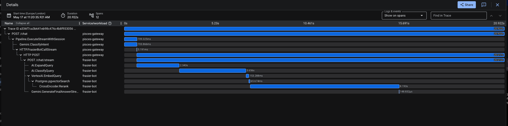

# Pisces API Gateway 🐟

An intelligent, high-performance API Gateway built in Go for orchestrating a multi-agent Retrieval-Augmented Generation (RAG) ecosystem. 

Pisces acts as the central brain of the architecture. Instead of just blindly proxying traffic, it intercepts user queries and enriches them using LLMs and vector embeddings before routing them to domain-specific downstream bots (like the Frasier Bot).

## ✨ Key Features

* **🧠 Smart Pipeline:** Every request goes through a rigorous NLP pipeline: Query Rewriting (resolving pronouns from history), Semantic Embedding, and Zero-Shot Intent Classification.
* **⚡ Semantic Caching:** Uses Redis as a vector database to cache responses. If a user asks a question that is *semantically similar* to a previous question (e.g., "Who did Frasier marry?" vs. "Who was Frasier's wife?"), Pisces returns the cached answer instantly, saving LLM tokens and downstream compute.
* **📡 Real-Time SSE Streaming:** Engineered for zero-latency typewriter effects using Server-Sent Events. The gateway dynamically streams pipeline milestones (e.g., "Scanning semantic cache registers") followed instantly by real-time LLM token delivery.
* **🔭 Distributed Tracing:** Fully instrumented with OpenTelemetry and GCP Cloud Trace. Every pipeline execution is trackable across microservices, and internal span names are mapped directly to UI loading states.
* **🔄 OpenAI Compatibility:** Exposes a standard `/v1/chat/completions` endpoint, allowing you to plug this gateway directly into any existing UI or tool that expects an OpenAI-compatible backend.
* **💾 Distributed Memory:** Manages conversational state automatically using Redis and ULID-based session tracking. Downstream bots remain completely stateless.
* **🔐 Secure by Default:** Integrates natively with GCP Secret Manager for API keys and Workload Identity for seamless GKE authentication.

## 🔭 Observability & Tracing

Pisces uses OpenTelemetry to ensure complete visibility into the asynchronous RAG pipeline. Spans track the lifecycle of every request—from Redis cache lookups to Gemini intent classification, all the way down through the proxy into the downstream bot network.

The gateway's `tracing` package natively bridges the gap between backend observability and front-end user experience. Internal telemetry span names (like `Vertex.EmbedQuery`) are systematically translated and piped down the SSE stream as human-readable UI updates. Every request returns an `X-Trace-Id` header for instant log correlation.

## 🏗️ Architecture & Request Flow

When a request hits the `/chat` endpoint, it executes the following `pipeline.go` flow:

1. **Session Hydration:** Fetches the user's conversational history from Redis.
2. **Query Reformulation:** An LLM rewrites the query to make it standalone (e.g., "Did he like her?" -> "Did Frasier like Lilith?").
3. **Embedding Generation:** Converts the rewritten query into a vector representation.
4. **Cache Lookup:** Checks the Redis Semantic Cache for a >90% vector match. If hit, return early!
5. **Intent Routing:** An LLM classifier determines the topic (e.g., `frasier` or `generic`) to route to the correct downstream microservice.
6. **Downstream Proxy:** Forwards the enriched payload to the target bot. The stream egress leg utilizes a dynamic `bufio.Reader` to seamlessly digest and pass through massive >64KB metadata JSON payloads without dropping the connection.
7. **State Sync:** Asynchronously updates the Semantic Cache and Session History.

## 🎛️ Dynamic Configuration (Headers)

You can control the Gateway's behavior on a per-request basis using custom HTTP headers:

* `X-Pisces-Session-ID`: A ULID string to track conversation history.
* `X-Pisces-Flag-SkipCache`: `true` | Bypasses the semantic cache lookup.
* `X-Pisces-Flag-NoSession`: `true` | Executes a purely stateless request without reading/writing to Redis.
* `X-Pisces-Similarity-Threshold`: `0.0 - 1.0` | Overrides the default 0.90 semantic cache hit threshold.

## 🚀 API Endpoints

* `POST /chat` - The primary entry point for custom clients (returns answer, retrieved contexts, and raw contexts). Send `"stream": true` in the JSON body to initiate the SSE pipeline.
* `POST /v1/chat/completions` - Standard OpenAI-compatible completions endpoint. Supports SSE via standard stream flags.
* `GET /v1/models` - Standard OpenAI-compatible models endpoint.
* `DELETE /cache` - Admin endpoint to flush the Redis semantic cache.
* `GET /health` - Liveness probe for Kubernetes.

## 🛠️ Tech Stack & Deployment

* **Language:** Go 1.26
* **AI Provider:** Google Gemini API (via standard `llm` interfaces)
* **Datastore:** Redis (Session Store & Vector Semantic Cache)
* **Infrastructure:** Packaged as a Docker container and deployed via Helm charts (`/helm-chart`) to Google Kubernetes Engine (GKE).